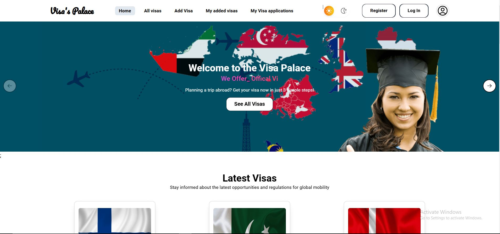

## FrontEnd_
# Visa Palace - Your Trusted Visa Processing Partner

[Live Site URL](https://b-10-assignment-10.web.app/)

VisaEase is a comprehensive solution designed to simplify visa processing for individuals and businesses. Whether you need to add, manage, or delete visa applications, our platform ensures a smooth and user-friendly experience.

## Tecnology 

- **ReactJs**
- **NodeJs**
- **ExpressJs**
- **MongoDB**
- **React-Router-Dom**

## Features

- **Add Visa Applications**: Easily add new visa applications with a streamlined and intuitive form interface.
- **Delete Visa Applications**: Remove outdated or invalid visa applications securely with a few clicks.
- **View and Manage Visas**: Access a list of all submitted visa applications with real-time updates and advanced filtering options.
- **Secure User Authentication**: Ensure the safety of your data with robust user login and authentication mechanisms.
- **Responsive Design**: Enjoy seamless navigation across devices, including desktops, tablets, and smartphones.

## Pages Included

1. **Home Page**: An overview of our services with quick access to the primary features.
2. **Add Visa Page**: A form to enter all necessary details for a new visa application.
3. **View Visas Page**: A dashboard to browse and manage submitted applications.
4. **Delete Visa Page**: A secure section for removing unnecessary visa records.

## How to Use

1. Visit the [Live Site](https://b-10-assignment-10.web.app/).
2. Create an account or log in to access the features.
3. Navigate to the "Add Visa" page to submit a new application.
4. Use the "View Visas" page to check the status or details of existing applications.
5. Remove applications easily via the "Delete Visa" page.

## Backend

# VisaEase Backend API

This is the backend API for the VisaEase platform, providing robust functionality for managing visas, user feedback, and visa applications. Built with scalability and security in mind, the API supports seamless integration for any visa processing service.

## Features

- **CRUD Operations for Visas**: Create, Read, Update, and Delete visa details with secure endpoints.
- **Feedback Management**: Allow users to submit feedback and retrieve feedback data for analytics.
- **Visa Application Management**: Manage visa application lifecycles, from

## API Endpoints

### Visa Management

- **GET /api/visas** - Retrieve all visas.
- **GET /api/visas/:id** - Retrieve details of a specific visa by ID.
- **POST /api/visas** - Create a new visa record.
- **PUT /api/visas/:id** - Update an existing visa record.
- **DELETE /api/visas/:id** - Delete a visa record.

### Feedback Management

- **GET /api/feedback** - Retrieve all feedback submissions.
- **POST /api/feedback** - Submit new user feedback.

### Visa Application Management

- **GET /api/applications/email** - Retrieve all visa via email auth applications.
- **GET /api/applications/:id** - Retrieve details of a specific visa application by ID.
- **POST /api/applications** - Submit a new visa application.
- **PUT /api/applications/:id** - Update an existing visa application.
- **DELETE /api/applications/:id** - Delete a visa application.

### Install Local Mashine

- **GET /api/applications/email** - 
- **GET /api/applications/:id**
- **POST /api/applications** 
- **PUT /api/applications/:id**
- **DELETE /api/applications/:id** 
